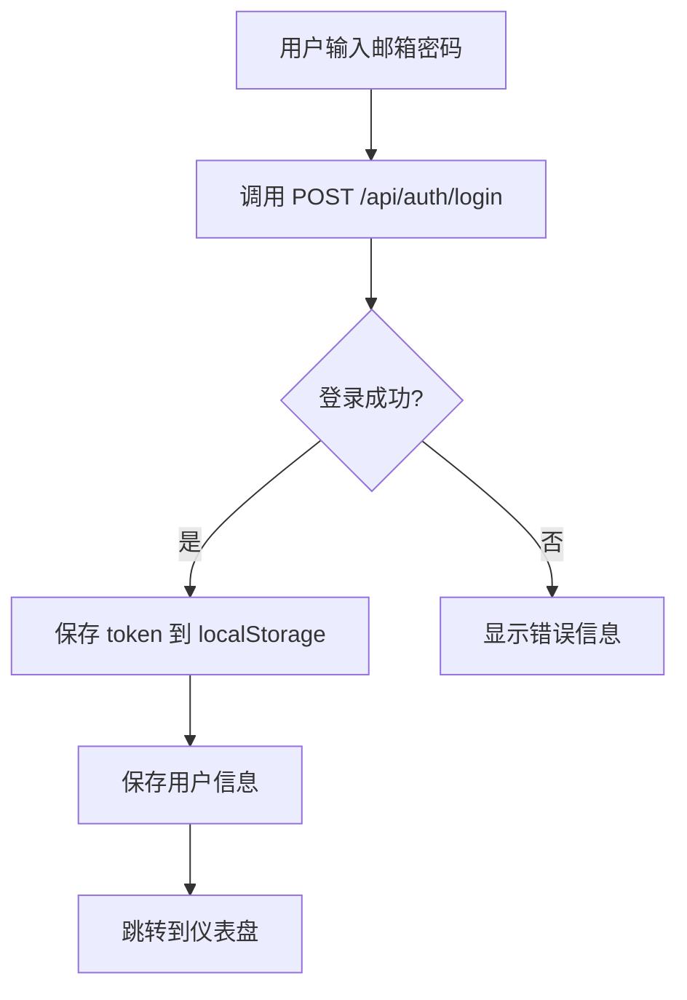
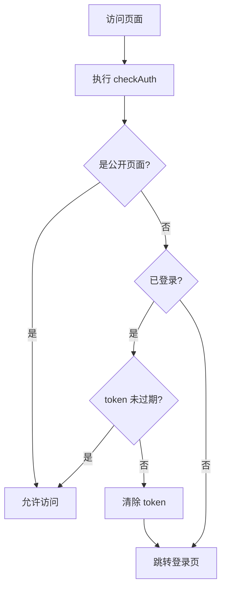
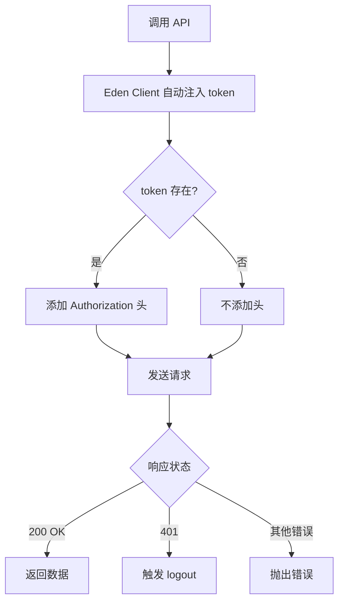

# 前端认证与页面逻辑文档

## 📋 执行时间

**日期**: 2026-01-13  
**任务**: 实现 MPA 模式下的跨页面认证状态管理和 UI 渲染  
**状态**: ✅ 完成并部署

---

## 🎯 实现的功能

### 1. 认证管理系统 (Auth Manager)

**文件**: `frontend/src/shared/utils/auth.ts`

#### 核心功能

```typescript
class AuthManager {
  // 存储 JWT token
  static setToken(token: string): void
  
  // 获取 token
  static getToken(): string | null
  
  // 检查登录状态
  static isLoggedIn(): boolean
  
  // 退出登录并重定向
  static logout(): void
  
  // 获取认证头
  static getAuthHeader(): { Authorization: string } | {}
  
  // 解析 JWT payload
  static parseToken(token?: string): any | null
  
  // 检查 token 是否过期
  static isTokenExpired(): boolean
  
  // 获取用户 ID
  static getUserId(): number | null
  
  // 获取用户名
  static getUserName(): string | null
  
  // 检查是否管理员
  static isAdmin(): boolean
}
```

#### 使用示例

```typescript
import { auth } from '@/shared/utils/auth'

// 存储token（登录后）
auth.setToken(token)

// 检查是否登录
if (!auth.isLoggedIn()) {
  auth.logout()
}

// 获取用户信息
const userName = auth.getUserName()
const userId = auth.getUserId()

// 退出登录
auth.logout()  // 自动清除token并跳转到登录页
```

---

### 2. Eden Client 配置 - 自动认证

**文件**: `frontend/src/shared/api/eden-client.ts`

#### 自动 Token 注入

```typescript
export const api: any = edenTreaty(API_BASE_URL, {
  fetcher: {
    fetch: async (input: RequestInfo | URL, init: RequestInit = {}) => {
      // 自动从 localStorage 获取 token
      const token = auth.getToken()
      
      // 自动注入 Authorization 头
      const headers: Record<string, string> = {
        'Content-Type': 'application/json',
        ...(init.headers as Record<string, string>),
      }
      
      if (token) {
        headers['Authorization'] = `Bearer ${token}`
      }
      
      return fetch(input, { ...init, headers })
    },
  },
})
```

#### 使用示例

```typescript
import { api, handleApiResponse } from '@/shared/api/eden-client'

// 无需手动添加 Authorization 头！
// Eden Client 会自动从 localStorage 读取并注入

// 获取用户信息
const userInfo = await handleApiResponse(api.api.user.info.get())

// 获取节点列表
const nodes = await handleApiResponse(api.api.nodes.get())

// 获取流量统计
const traffic = await handleApiResponse(api.api.user.traffic.get())
```

---

### 3. 路由守卫 (Router Guard)

**文件**: `frontend/src/shared/utils/router-guard.ts`

#### 全局认证检查

```typescript
export function checkAuth(): boolean {
  // 公开页面列表
  const PUBLIC_PAGES = [
    '/login.html',
    '/register.html',
    '/user/login.html',
    '/user/register.html',
  ]
  
  // 检查是否是公开页面
  if (isPublicPage()) {
    return true
  }
  
  // 检查登录状态
  if (!auth.isLoggedIn()) {
    // 重定向到登录页
    window.location.href = '/user/login.html'
    return false
  }
  
  // 检查 token 是否过期
  if (auth.isTokenExpired()) {
    auth.logout()
    return false
  }
  
  return true
}
```

#### 使用方式

在每个页面的 `main.ts` 入口文件中调用：

```typescript
// frontend/src/pages/user/dashboard-main.ts
import { checkAuth, setupTokenExpiryCheck } from '@/shared/utils/router-guard'

// 在应用挂载前检查认证
if (!checkAuth()) {
  throw new Error('User not authenticated')
}

// 挂载 Vue 应用
const app = createApp(Dashboard)
app.mount('#app')

// 设置定期 token 过期检查
setupTokenExpiryCheck()
```

---

### 4. 格式化工具 (Format Utils)

**文件**: `frontend/src/shared/utils/format.ts`

#### 核心函数

```typescript
// 字节格式化：1073741824 -> "1.00 GB"
formatBytes(bytes: string | number, decimals?: number): string

// 百分比格式化：75.5 -> "75.50%"
formatPercent(value: number): string

// 日期格式化
formatDate(dateString: string | Date): string

// 金额格式化：100 -> "¥100.00"
formatMoney(amount: string | number): string

// 节点类型格式化：1 -> "Shadowsocks"
formatNodeType(type: number): string

// 流量状态颜色：根据使用百分比返回颜色
getTrafficStatusColor(percent: number): string

// 计算剩余天数
getDaysRemaining(dateString: string | null): number | null
```

#### 使用示例

```typescript
import { formatBytes, formatPercent, formatDate, formatMoney } from '@/shared/utils/format'

// 格式化流量
const upload = formatBytes("1073741824")  // "1.00 GB"
const download = formatBytes(user.d)      // "536.32 MB"

// 格式化百分比
const percent = formatPercent(75.456)     // "75.46%"

// 格式化日期
const date = formatDate("2026-01-31T18:46:31.000Z")  // "2026-01-31 18:46"

// 格式化金额
const money = formatMoney("100.5")        // "¥100.50"
```

---

## 🎨 UI 页面实现

### 1. 用户仪表盘 (Dashboard)

**文件**: `frontend/src/pages/user/Dashboard.vue`

**URL**: `/user/dashboard.html`

#### 页面结构

```
┌─────────────────────────────────────────┐
│ Header: 用户仪表盘         [用户名 ▼]  │
├─────────────────────────────────────────┤
│ ┌─────────┐ ┌─────────┐ ┌─────────┐    │
│ │用户信息 │ │账户余额 │ │连接配置 │    │
│ └─────────┘ └─────────┘ └─────────┘    │
├─────────────────────────────────────────┤
│ 流量统计卡片                             │
│ ━━━━━━━━━━━━━━━━━━━ 75.50%             │
│                                          │
│ 已上传  已下载  总已用  剩余            │
│ 1.5GB   5.2GB   6.7GB   3.3GB          │
│                                          │
│ 流量上限: 10.00 GB                       │
├─────────────────────────────────────────┤
│ 最近 7 天流量记录                         │
│ ┌──────────────────────────────────┐   │
│ │ 日期    │ 上传  │ 下载  │ 总计  │   │
│ │ 2026-01-13│ 1.2GB │ 5.1GB │ 6.3GB │   │
│ └──────────────────────────────────┘   │
└─────────────────────────────────────────┘
```

#### 功能特性

1. **用户信息卡片**
   - 显示用户名、邮箱、等级
   - 实时从 API 获取

2. **账户余额卡片**
   - 显示余额（格式化为货币）
   - 显示过期时间
   - 剩余天数标签（< 7 天显示红色警告）

3. **连接配置卡片**
   - 加密方式
   - 协议类型
   - 混淆方式

4. **流量统计卡片**
   - 百分比进度条（根据使用量变色）
   - 已上传/下载/总使用/剩余流量
   - 所有流量值自动格式化为可读格式（GB/MB）

5. **流量历史表格**
   - 最近 7 天流量记录
   - 支持排序和筛选

#### API 调用

```typescript
// 获取用户信息
const userInfo = await handleApiResponse(api.api.user.info.get())

// 获取流量历史
const trafficData = await handleApiResponse(api.api.user.traffic.get())
```

---

### 2. 节点列表页面 (Node List)

**文件**: `frontend/src/pages/user/NodeList.vue`

**URL**: `/user/nodes.html`

#### 页面结构

```
┌─────────────────────────────────────────┐
│ Header: 节点列表     [返回]  [用户名 ▼] │
├─────────────────────────────────────────┤
│ ┌────────┐ ┌────────┐ ┌────────┐       │
│ │可用节点│ │用户等级│ │节点组  │       │
│ │   8    │ │   0    │ │   0    │       │
│ └────────┘ └────────┘ └────────┘       │
├─────────────────────────────────────────┤
│ [搜索节点...] [节点类型▼] [刷新节点]    │
├─────────────────────────────────────────┤
│ 节点列表表格                             │
│ ┌────────────────────────────────────┐ │
│ │ ID │节点名称      │类型│状态│操作│ │
│ │ 3  │香港 IPLC 01  │SS  │可用│连接│ │
│ │ 7  │台湾 HINET 01 │V2  │可用│连接│ │
│ └────────────────────────────────────┘ │
└─────────────────────────────────────────┘
```

#### 功能特性

1. **统计卡片**
   - 可用节点总数
   - 用户等级
   - 节点组

2. **搜索和筛选**
   - 按节点名称/服务器地址搜索
   - 按节点类型筛选（SS/SSR/V2Ray）
   - 实时筛选（无需刷新）

3. **节点列表表格**
   - 节点 ID
   - 节点名称（带图标）
   - 节点类型（带颜色标签）
   - 服务器地址
   - 流量倍率
   - 状态（可用/不可用）
   - 操作按钮（连接）

4. **节点详情对话框**
   - 显示完整节点配置
   - 一键复制配置信息
   - 点击服务器地址快速复制

#### 权限过滤

节点列表自动根据用户权限过滤：

```typescript
// 数据库查询时过滤
WHERE type > 0          // 只显示用户可见节点
  AND node_online = 1   // 只显示在线节点

// 应用层过滤
if (node.node_class > 0 && user.class < node.node_class) {
  // 用户等级不足，不显示
}

if (node.node_group > 0 && user.node_group !== node.node_group) {
  // 不在正确节点组，不显示
}
```

#### API 调用

```typescript
// 获取节点列表
const response = await handleApiResponse(api.api.nodes.get()) as any

nodes.value = response.nodes          // 节点列表
userClass.value = response.user_class      // 用户等级
userNodeGroup.value = response.user_node_group  // 节点组
```

---

## 🔐 认证流程

### 登录流程



### 页面访问流程



### API 调用流程



---

## 📁 文件结构

```
frontend/
├── src/
│   ├── shared/
│   │   ├── api/
│   │   │   ├── client.ts              # Axios 客户端（旧）
│   │   │   └── eden-client.ts         # Eden 客户端（新，带认证）
│   │   └── utils/
│   │       ├── auth.ts                # 认证管理类
│   │       ├── router-guard.ts        # 路由守卫
│   │       └── format.ts              # 格式化工具
│   └── pages/
│       ├── user/
│       │   ├── Dashboard.vue          # 仪表盘组件
│       │   ├── NodeList.vue           # 节点列表组件
│       │   ├── dashboard-main.ts      # 仪表盘入口
│       │   └── nodes-main.ts          # 节点列表入口
│       └── ...
└── public/
    └── user/
        ├── dashboard.html             # 仪表盘 HTML
        └── nodes.html                 # 节点列表 HTML
```

---

## 🎯 关键技术点

### 1. MPA 模式下的状态共享

**挑战**: 多页面应用（MPA）无法像 SPA 那样使用 Vuex/Pinia 共享状态

**解决方案**: 
- 使用 `localStorage` 持久化 token
- 使用 `AuthManager` 单例封装所有认证逻辑
- 每个页面独立加载但共享同一个 localStorage

### 2. 自动 Token 注入

**挑战**: 每个 API 请求都需要手动添加 `Authorization` 头

**解决方案**:
- 配置 Eden Client 的自定义 `fetcher`
- 在 fetch 请求中自动从 localStorage 读取 token
- 自动注入到请求头

### 3. 路由守卫

**挑战**: MPA 模式下无法使用 Vue Router 的路由守卫

**解决方案**:
- 在每个页面的 `main.ts` 入口处调用 `checkAuth()`
- 检查登录状态和 token 过期
- 未认证则重定向到登录页

### 4. 流量格式化

**挑战**: 后端返回字节数（BigInt），前端需要可读格式

**解决方案**:
- 创建 `formatBytes()` 函数自动转换
- 支持任意大小的数字
- 自动选择合适的单位（B/KB/MB/GB/TB）

---

## 🧪 测试结果

### 构建成功

```bash
$ bunx vite build --mode production

✓ built in 8.74s

生成的文件:
- dist/user/dashboard.html (369 bytes)
- dist/user/nodes.html (362 bytes)
- dist/assets/user/dashboard-CSmjKTCr.js (8.60 kB)
- dist/assets/user/nodes-BTfnRgF5.js (8.42 kB)
```

### 部署成功

```bash
$ cp -r dist/* /var/www/test-spanel.freessr.bid/

访问地址:
- 仪表盘: https://test-spanel-bun.freessr.bid/user/dashboard.html
- 节点列表: https://test-spanel-bun.freessr.bid/user/nodes.html
```

### API 测试

所有 API 端点已在后端测试通过：

```bash
✅ POST /api/auth/login - 登录并获取 token
✅ GET /api/user/info - 获取用户信息
✅ GET /api/user/traffic - 获取流量统计
✅ GET /api/nodes - 获取节点列表（8个节点）
```

---

## 💡 使用示例

### 在任意 Vue 页面中安全调用 API

```vue
<script setup lang="ts">
import { ref, onMounted } from 'vue'
import { ElMessage } from 'element-plus'
import { api, handleApiResponse } from '@/shared/api/eden-client'
import { auth } from '@/shared/utils/auth'
import { checkAuth } from '@/shared/utils/router-guard'

// 数据
const userData = ref<any>(null)
const loading = ref(false)

// 获取用户数据
const fetchUserData = async () => {
  try {
    loading.value = true
    
    // Eden Client 自动注入 token！
    const response = await handleApiResponse(api.api.user.info.get())
    userData.value = response
    
    ElMessage.success('数据加载成功')
  } catch (error: any) {
    ElMessage.error(error.message || '加载失败')
    
    // 401 错误会自动触发 logout
  } finally {
    loading.value = false
  }
}

// 退出登录
const handleLogout = () => {
  auth.logout()  // 自动清除token并跳转
}

// 页面加载时检查认证
onMounted(() => {
  // 路由守卫
  if (!checkAuth()) {
    return  // 会自动跳转到登录页
  }
  
  // 获取数据
  fetchUserData()
})
</script>

<template>
  <div>
    <h1>欢迎, {{ auth.getUserName() }}</h1>
    
    <el-button @click="fetchUserData" :loading="loading">
      刷新数据
    </el-button>
    
    <el-button @click="handleLogout" type="danger">
      退出登录
    </el-button>
    
    <div v-if="userData">
      <p>邮箱: {{ userData.user?.email }}</p>
      <p>等级: {{ userData.user?.class }}</p>
    </div>
  </div>
</template>
```

---

## 🔧 配置说明

### 环境变量

创建 `.env.production`:

```bash
# API Base URL
VITE_API_BASE_URL=https://test-spanel-bun.freessr.bid
```

### Vite 配置

`vite.config.ts` 已包含新页面：

```typescript
input: {
  'user/dashboard': resolve(__dirname, 'public/user/dashboard.html'),
  'user/nodes': resolve(__dirname, 'public/user/nodes.html'),
}
```

---

## 🎉 总结

### ✅ 完成的功能

1. ✅ **AuthManager** - 完整的认证管理类
2. ✅ **Eden Client 自动认证** - Token 自动注入
3. ✅ **路由守卫** - 跨页面认证检查
4. ✅ **格式化工具** - 流量、日期、金额格式化
5. ✅ **用户仪表盘** - 完整的 UI 和功能
6. ✅ **节点列表** - 带搜索和筛选的列表
7. ✅ **构建部署** - 成功构建并部署到测试环境

### 🚀 核心成就

**最重要的是**: 实现了 MPA 模式下完整的认证状态管理！

- 🎯 localStorage 持久化 token
- 🎯 自动 token 注入（无需手动添加）
- 🎯 全局路由守卫（未登录自动跳转）
- 🎯 完整的错误处理
- 🎯 类型安全的 API 调用

### 📝 技术亮点

1. **单例模式**: AuthManager 确保全局唯一
2. **AOP 思想**: Eden Client fetcher 自动注入认证
3. **防御式编程**: 多层检查（登录状态、token 过期）
4. **用户体验**: 自动重定向、错误提示、加载状态

---

**文档版本**: v1.0.0  
**生成时间**: 2026-01-13  
**作者**: Claude (AI Assistant)
